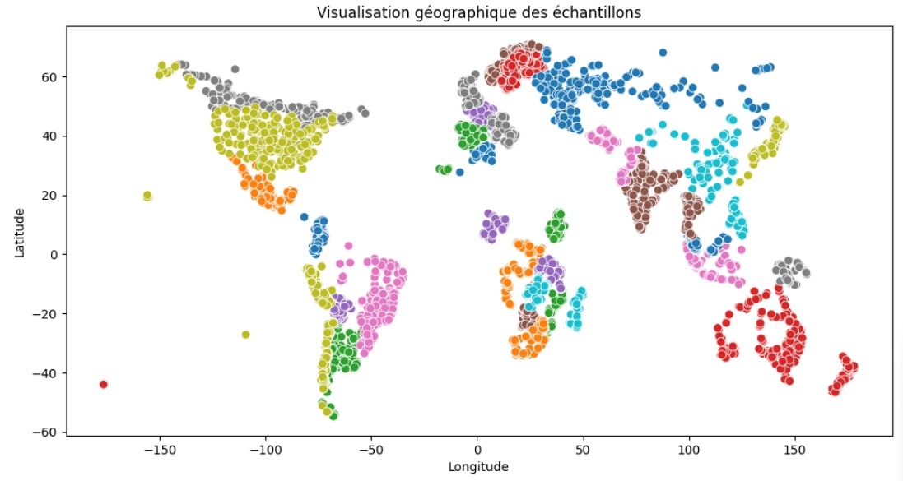
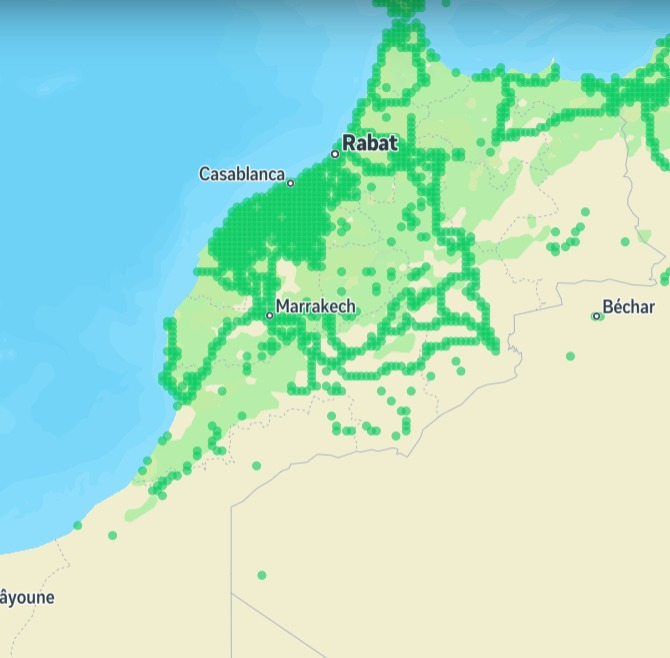
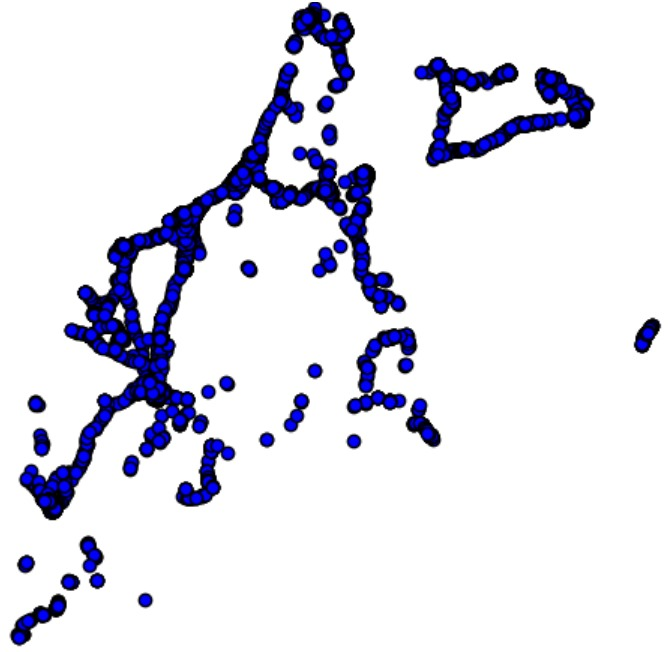
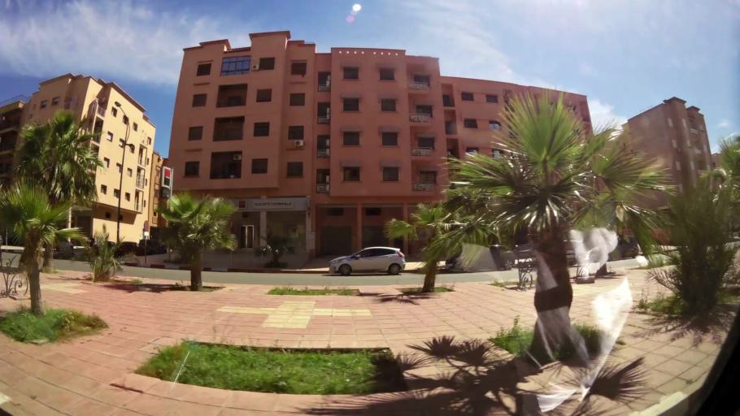
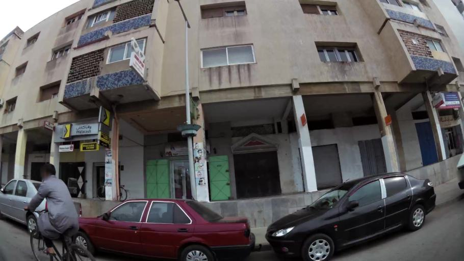
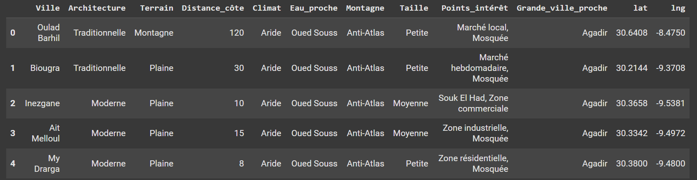

Données
===================

La première étape du projet **MarocExplorer** a été la **collecte des données**.  
Le principal défi rencontré a été l'**absence d'une source directe** d'images marocaines avec leurs **coordonnées géographiques** (latitude et longitude).  
Pour pallier ce problème, nous avons créé notre **propre dataset**, regroupant ces images avec leurs **labels géographiques**.

.. note::
   La collecte de données géolocalisées représente un enjeu majeur dans les projets de vision par ordinateur liés à la reconnaissance de lieux. Notre approche multi-sources nous a permis de constituer un dataset riche et représentatif du territoire marocain.

Sources des données
-------------------

Nous avons collecté ces données à partir de **trois sources principales** :

**OSV5M Dataset de Hugging Face**  
Lien : `OSV5M sur Hugging Face <https://huggingface.co/datasets/osv5m/osv5m/tree/main>`_ |huggingface|

.. note::
   OSV5M (Open Street View 5 Million) est un dataset open-source comprenant plus de 5 millions d'images de vues de rues géolocalisées à travers le monde. Pour notre projet, nous avons extrait uniquement les images du Maroc, qui représentent environ 2% du dataset total.

**Mapillary Vistas**  
Lien : `Mapillary Vistas Dataset <https://www.mapillary.com/dataset/vistas>`_ |mapillary|

**Google Street View (dataset depuis Kaggle)**  
Lien : `Google Street view sur Kaggle <https://www.kaggle.com/datasets/paulchambaz/google-street-view>`_ |Kaggle|

.. |huggingface| image:: _static/HugginFace.png
   :width: 30
   :height: 30
   :align: middle
   :alt: Hugging Face

Richesse des Données
-------------------

La source la plus **riche en données** pour notre projet **MarocExplorer** est sans aucun doute le dataset **OSV5M de Hugging Face**. Nous avons sélectionné **uniquement les images du Maroc** accompagnées de leurs **coordonnées géographiques** (latitude et longitude).

.. note::
   Le processus de filtrage a impliqué l'utilisation des coordonnées géographiques pour isoler les images situées dans les limites territoriales du Maroc. Cette opération a nécessité la définition précise des frontières géographiques du pays dans notre système.

Distribution initiale
^^^^^^^^^^^^^^^^^^^^^

Les données brutes sont distribuées en fonction des **coordonnées géographiques**.  
Voici un aperçu visuel de cette distribution :

.. note::
   **Distribution globale du dataset OSV5M**
   
   Le dataset OSV5M contient plus de 5 millions d'images réparties à travers le monde, avec une distribution inégale :
   
   * **Amérique du Nord** : ~40% des images (forte concentration aux États-Unis)
   * **Europe** : ~30% des images (couverture dense dans les pays occidentaux)
   * **Asie** : ~20% des images (concentration en Asie de l'Est et du Sud-Est)
   * **Afrique** : ~5% des images (dont environ 25% pour l'Afrique du Nord)
   * **Autres régions** : ~5% (Amérique du Sud, Océanie)

Distribution des données marocaines
^^^^^^^^^^^^^^^^^^^^^^^^^^^^^

Les images collectées pour le projet MarocExplorer présentent une **répartition géographique représentative du territoire marocain**, avec une concentration plus importante dans les zones urbaines et touristiques.

|distrib_map| |distrib_city|

.. note::
   Cette visualisation met en évidence une concentration d'images dans les zones urbaines et le long des axes routiers principaux, avec une densité particulièrement élevée dans les régions touristiques comme Marrakech, Fès et la côte atlantique. Les zones montagneuses (Atlas) et désertiques (Sud-Est) sont relativement moins représentées.

Exemples d'images du dataset
^^^^^^^^^^^^^^^^^^^^^^^^^^^

Voici quelques exemples représentatifs des images collectées dans notre dataset marocain :

.. |exemple1| image:: _static/exemple1.jpg
   :width: 32%
   :alt: Exemple 1

|exemple1| |exemple2| |exemple3|

.. note::
   Ces exemples illustrent la diversité des données capturées, représentant différentes régions du Maroc avec leurs caractéristiques architecturales et paysagères distinctives.
---

Enrichissement des Données (Features Engineering)
--------------------------

Pour **améliorer les performances du modèle**, nous avons enrichi chaque image avec des informations supplémentaires :

* Nous avons associé chaque image à sa **ville correspondante** en calculant la **distance** entre l'image et les villes marocaines à partir de leurs coordonnées géographiques.
* Les coordonnées des villes proviennent de cette source :
   * Lien : `Coordonnées des villes marocaines <https://simplemaps.com/data/ma-citi>`_

.. note::
   Le calcul des distances a été réalisé en utilisant la formule de Haversine, qui prend en compte la courbure de la Terre et fournit donc des distances plus précises que les calculs euclidiens. Cela était particulièrement important pour les images situées dans des zones frontalières ou côtières.

.. code-block:: python

    def haversine_distance(lat1, lon1, lat2, lon2):
        """
        Calcule la distance du grand cercle entre deux points 
        sur la Terre (spécifiés en degrés décimaux).
        """
        # Conversion des degrés décimaux en radians
        lat1, lon1, lat2, lon2 = map(np.radians, [lat1, lon1, lat2, lon2])
        
        # Formule de Haversine
        dlon = lon2 - lon1
        dlat = lat2 - lat1
        a = np.sin(dlat / 2)**2 + np.cos(lat1) * np.cos(lat2) * np.sin(dlon / 2)**2
        c = 2 * np.arcsin(np.sqrt(a))
        r = 6371  # Rayon de la Terre en kilomètres
        return c * r

.. code-block:: python

   # Chargement de ta dataframe villes
   villes_df = pd.read_csv(r"C:\Users\hp\Desktop\ma.csv")  # Doit contenir : city, lat, lng, etc.

   # Chargement de ta dataframe des points
   points_df = pd.read_csv(r"C:\Users\hp\Desktop\Data_maroc\maroc_data.csv")  # Doit contenir : latitude, longitude
   points_df = points_df.drop('unique_country' , axis=1)

   # Fonction pour trouver la ville la plus proche
   def trouver_ville_proche(lat, lon, villes_df):
      distances = haversine_distance(lat, lon, villes_df['lat'].values, villes_df['lng'].values)
      idx_min = np.argmin(distances)
      return villes_df.iloc[idx_min]['city']

   # Appliquer la fonction à tous les points
   points_df['city'] = points_df.apply(lambda row: trouver_ville_proche(row['latitude'], row['longitude'], villes_df), axis=1)

   # Résultat
   print(points_df)

   points_df.to_csv(r'C:\Users\hp\Desktop\maroc_data_finale.csv', index=False)

En plus de la **géolocalisation**, nous avons créé des **données supplémentaires sur chaque ville** (région, points d'intérêt...) pour permettre au modèle d'exploiter des informations contextuelles.

Les données brutes sont distribuées en fonction des **coordonnées géographiques**.  
Voici un aperçu visuel de cette distribution :

---

.. note::
   Cette contextualisation des données a impliqué l'intégration d'informations démographiques, historiques et culturelles pour chaque ville. Nous avons également ajouté des métadonnées concernant les monuments historiques, les sites touristiques et les particularités architecturales régionales, permettant ainsi une classification plus fine.

Pour plus de détails sur la démarche et les calculs, consultez notre **notebook Colab** :

.. attention::
   Veuillez remplacer les chemins des fichiers existants dans les cellules du notebook par ceux correspondant à votre environnement.

.. raw:: html

   

.. warning::
   Les coordonnées GPS peuvent présenter une marge d'erreur, particulièrement dans les zones urbaines denses où les bâtiments peuvent interférer avec la précision du signal. Cette limitation a été prise en compte lors de l'étiquetage des images.

.. toctree::
   :maxdepth: 3
   :caption: Contenu:
   .. prev:: Équipe
   .. next:: Modèle

